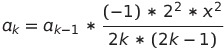
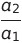

Lab. Work No.1 Taylor Series  
=

Source is free and available at https://github.com/EvalBeno/RTR-105/


Purpose
==


This directory contains the code for calculating squared cosine for the function
===

The code derived from this equation:

However if we're using this function directly you will **run out of memory** because the factorial in the denominator will make the function to have an overflow. To avoid this we can augment the each value for the sum to use an a value from the equation before like this:



This equation finds the each value for the sum function to well, sum. The recursive function was found by dividing current value of a by last value of a like this:



Code for the function:
==
```
#include <stdio.h>
#include <stdlib.h>
#include <math.h>

void ASCII(){
    printf("\n\n--------------------------------------\n");
    printf("|           500                      |\n");
    printf("|         -------                    |\n");
    printf("|          \\         k  2k  2k-1     |\n");
    printf("|    2      \\    (-1) *x  *2         |\n");
    printf("| cos (x)=    >  -----------------   |\n");
    printf("|           /          (2k)!         |\n");
    printf("|          /                         |\n");
    printf("|         -------                    |\n");
    printf("|           k=1                      |\n");
    printf("--------------------------------------\n\n");
    }       


double Squared_Cosine(double x, int sumof);

//=================================================================
int main()
{
    double x, funcy, S;
    int const sumof=500;
    printf("\t\t\tSQUARED COSINE CALCULATOR USING TAYLOR SERIES\t\n");
    printf("Enter value of x: ");
    scanf("%lf", &x);
    funcy=cos(x)*cos(x);
    ASCII();
    S=Squared_Cosine(x,sumof);
    printf("   2\ncos (%lf)= %.15lf\n", x, funcy);
    printf("Algorihtm Value: %.15lf\n", S);
    
    return 0;
}
//==================================================================

double Squared_Cosine(double x, int sumof)
{
    int k=2;
    double a=0, S=0;
    a=-pow(x,2);
    S=S+a;
    while(k<=sumof){
        a=a*(-1)*4*pow(x,2)/(2*k*(2*k-1)); 
        S=a+S;
        if(sumof-1==k) printf("a%d=%.15lf\n", k, a);
        if(sumof==k) printf("a%d=%.15lf\n", k, a);
        k++;
        }
    S=1.0+S;
    return S;
}
```

Using the Taylor Series method we can make a function which aproximates the squared cosine value fairly accurately as it can be seen in this graph:
===


**Thus meaning that we can use simple mathematical operations to find a value of a squared cosine.**


Usage
==

To compile use:`gcc Laboratory\ work\ Nr.1.c -lm`

After you launch the function it looks like this
==
```
                        SQUARED COSINE CALCULATOR USING TAYLOR SERIES
Enter value of x: 3  


--------------------------------------
|           500                      |
|         -------                    |
|          \         k  2k  2k-1     |
|    2      \    (-1) *x  *2         |
| cos (x)=    >  -----------------   |
|           /          (2k)!         |
|          /                         |
|         -------                    |
|           k=1                      |
--------------------------------------

a499=-0.000000000000000
a500=0.000000000000000
   2
cos (3.000000)= 0.980085143325183
Algorihtm Value: 0.980085143325182

```

There is also source code for the graphs made to use it:
====

To be able to use it you must have GNUPLOT installed.

Type in terminal:  
`gnuplot`  
And when you are inside GNUPLOT program type in:  
`load 'gnuplotscript.p'`  


*This project was made as part of computer studies class in Riga Techincal University*

