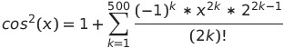
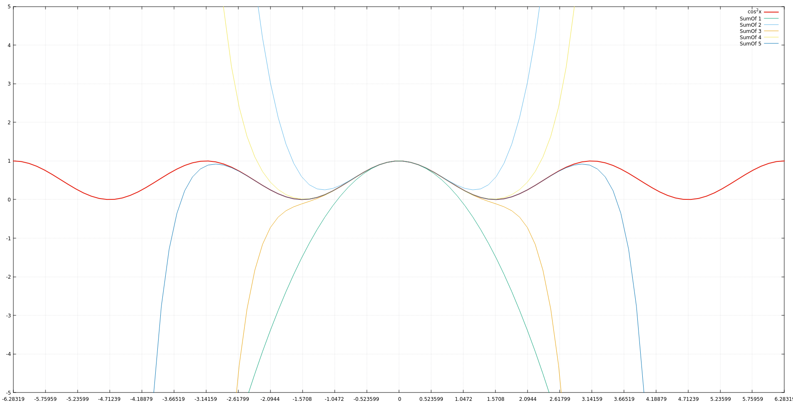

Lab. Work No.1 Taylor Series  
=

Source is free and available at https://github.com/EvalBeno/RTR-105/

Purpose
==

This directory contains the code for calculating squared cosine for the function
===

The code derived from this equation:

Using the Taylor Series method we can make a function which aproximates the squared cosine value fairly accurately as it can be seen in this graph:
===

Thus meaning that we can use simple mathematical operations to find a value of a squared cosine.
====

*Note:* This equation loses it's accuracy if we use value of x very distant from 0. This could be made to get a greater accuracy by recursively removing or adding pi and then using the Taylor Series method.

Usage
==

To compile use:`gcc Laboratory\ work\ Nr.1.c -lm`

There is also source code for the graphs made to use it:
====

To be able to use it you must have GNUPLOT installed.

Type in terminal:  
`gnuplot`  
And when you are inside GNUPLOT program type in:  
`load 'gnuplotscript.p'`  

This project was made as part of computer studies class in Riga Techincal University
=====
