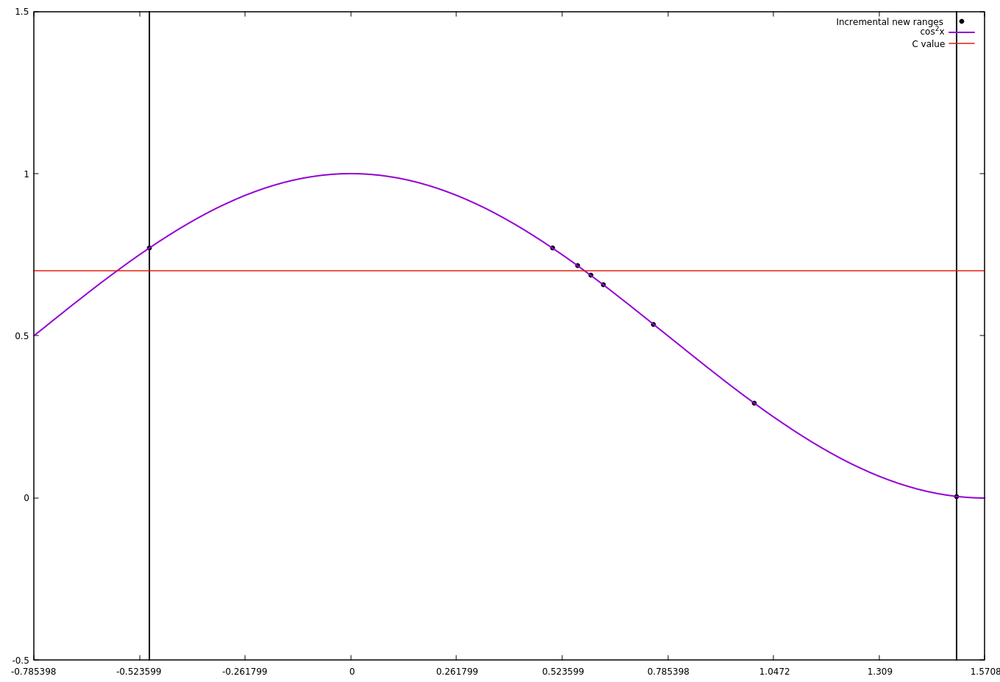

Lab. Work No.2 Roots
=

Source is free and available at https://github.com/EvalBeno/RTR-105/


Purpose
==

This directory contains code to find c value of the function which can be modified in code.


Working Principle
==

This code works by finding where the function bisects X axis.

This code works with the principle that the value of the function is in between given interval \[a:b]

The code checks by multiplying the interval function values to see if it is less than 0, this signifies that the function value at the interval points has diferrent signs.

The function works by making interval smaller and smaller until the interval is smaller than given error that we can call it the function value.

This is shown here:
====



As you can see the function makes the interval smaller by finding midpoint of of those interval values and moves the interval by checking where it bisects the axis.


**x is the new interval value**

If \[a:x] bisects the axis then b=x, but if it bisects in interval \[x:b] then a=x.


Code for this method:
===

```
#include <stdio.h>
#include <math.h>

double function(double x, double c);

int main (){
    double a, b, c, precision, x;
    unsigned int t=0;
    
    printf("In the interval [a:b]\n");
    printf("Enter the a value: "); scanf("%lf", &a);
    printf("Enter the b value: "); scanf("%lf", &b);
    printf("The function f(x)=c\n");
    printf("Enter the c value: "); scanf("%lf", &c);
    printf("Enter the precision(ex. 0.0001): "); scanf("%lf", &precision);
    
    if(function(a, c)*function(b, c)>0){
        printf("The function value is not in the interval[%lf:%lf]\n", a, b);
        return 1;
    }
    if(b>a){
        while((function(b, c)-function(a, c))>precision){
            t++;
            x=(a+b)/2;
            if(function(a, c)*function(x, c)>0) a=x;
            else b=x;
            printf("At the %2u iteration: f(%.2lf)=%.2lf\n", t, x, function(x, 0));
        }
    }
    else{
        while((function(a, c)-function(b, c))>precision){
            t++;
            x=(a+b)/2;
            if(function(a, c)*function(x, c)>0) a=x;
            else b=x;
            printf("At the %2u iteration: f(%.2lf)=%.2lf\n", t, x, function(x, 0));
        }
    }
    printf("_______________________________________________\n");
    printf("Function f(%lf)=%lf, and it took %u iterations.\n", x, function(x, 0), t);
    
    return 0;
}

double function(double x, double c){
    return x-c;
}
```

Usage
==

To compile use:`gcc Laboratory\ work\ Nr.2.c -lm`


After you launch the program in terminal it shows this
==
```

```

*This project was made as part of computer studies class in Riga Techincal University*
