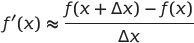
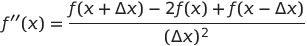
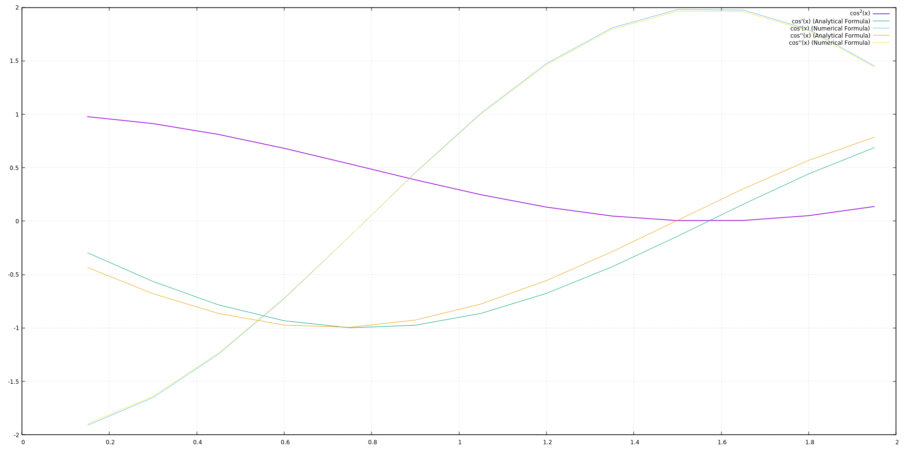
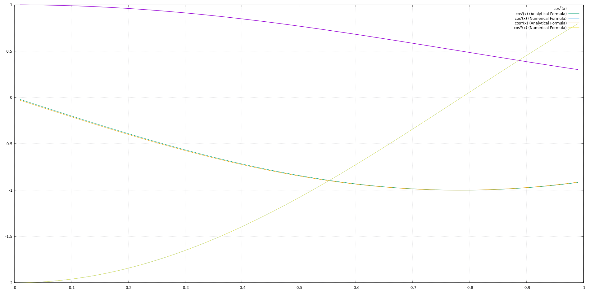

Lab. Work No.3 Numerical Derivative
=

Source is free and available at https://github.com/EvalBeno/RTR-105/


Purpose
==
This program can be used to find out the derivative of a function which can be modified in the code.


* The program works by finding first order forward difference numerical derivative. Which is calculated like this:  
    
* Also it calculates the analytical derivative which equals to: -sin(2*x)  
* Then the second order derivative is calculated by having first order derivatives and dividing yet again by delta.  
* Yet again it also calculates analytical derivative of the second order which equals to: -2cos(2x)  
* Then it moves the new x value to x+Δ and the cycle continues until it reaches the indicated b value.

Keeping in mind that this is positive difference you can calculate second order derivative but it will only work on the second value, therefore you can see that there is no value on the first numerical derivative since there is no difference.  
*This could be improved by using this equation found on http://math.umd.edu/~dlevy/classes/amsc460/na-notes.pdf (p.95 fig.(5.5)):*  
  


Table for example of the result when delta=0.05
====
x | f(x) | Analytical Derivative | Numerical Derivative | Analytical second order Derivative | Numerical second order Derivative
------|--------|---------------|-----------|------------|-----------
0.000000 | 1.000000 | -0.000000 | -0.049958 | -2.000000 |
0.050000 | 0.997502 | -0.099833 | -0.149376 | -1.990008 | -1.988351
0.100000 | 0.990033 | -0.198669 | -0.247301 | -1.960133 | -1.958500
0.150000 | 0.977668 | -0.295520 | -0.342755 | -1.910673 | -1.909081
0.200000 | 0.960530 | -0.389418 | -0.434784 | -1.842122 | -1.840587
0.250000 | 0.938791 | -0.479426 | -0.522469 | -1.755165 | -1.753703
0.300000 | 0.912668 | -0.564642 | -0.604934 | -1.650671 | -1.649296
0.350000 | 0.882421 | -0.644218 | -0.681355 | -1.529684 | -1.528410
0.400000 | 0.848353 | -0.717356 | -0.750967 | -1.393413 | -1.392253
0.450000 | 0.810805 | -0.783327 | -0.813077 | -1.243220 | -1.242184
0.500000 | 0.770151 | -0.841471 | -0.867062 | -1.080605 | -1.079704
0.550000 | 0.726798 | -0.891207 | -0.912384 | -0.907192 | -0.906437
0.600000 | 0.681179 | -0.932039 | -0.948589 | -0.724716 | -0.724112
0.650000 | 0.633749 | -0.963558 | -0.975317 | -0.534998 | -0.534552
0.700000 | 0.584984 | -0.985450 | -0.992299 | -0.339934 | -0.339651
0.750000 | 0.535369 | -0.997495 | -0.999367 | -0.141474 | -0.141357
0.800000 | 0.485400 | -0.999574 | -0.996450 | 0.058399 | 0.058350
0.850000 | 0.435578 | -0.991665 | -0.983576 | 0.257689 | 0.257474
0.900000 | 0.386399 | -0.973848 | -0.960875 | 0.454404 | 0.454026
0.950000 | 0.338355 | -0.946300 | -0.928573 | 0.646579 | 0.646040

By choosing smaller and smaller intervals you can increase the accuracy of the program
===

Example of the function which has delta of 0.15:
====
  

As you can see the function has a visible difference between analytical and numerical first order derivatives.  

Example of the function which has delta of 0.01:
====


As you can see the graph has smaller error when the delta approaches closer and closer to absolute zero.  

Code for this method:
===

```
#include <stdio.h>
#include <math.h>
#define N 100

double function(double x);
double Derivative(double x);
double dDerivative(double x);
//============================================

void WriteToFile(double x_value[N], double F_value[N], double d_analytical[N], double dd_analytical[N], double d_numerical[N], double dd_numerical[N], int i){
    
    FILE* input = fopen("derivative.dat", "w");
    
    fprintf(input ,"#x\t\tf(x)\t\tAnalytical'\tNumerical'\tAnalytical''\tNumerical''\n");
    fprintf(input ,"#-------------------------------------------------------------------------------------------\n");
    fprintf(input ,"%lf\t%lf\t%lf\t%lf\t%lf\t\t\n", x_value[0], F_value[0], d_analytical[0], d_numerical[0], dd_analytical[0]);
    for (int j=1; j<i; j++){
        fprintf(input, "%lf\t%lf\t%lf\t%lf\t%lf\t%lf\n", x_value[j], F_value[j], d_analytical[j], d_numerical[j], dd_analytical[j], dd_numerical[j]);
    }
    fclose(input);
}

//==========================================

int main(){
    double a, b, delta, x;
    double F_value[N],d_analytical[N], dd_analytical[N], d_numerical[N], dd_numerical[N], x_value[N];
    printf("a\tb\tdelta\n");
    scanf("%lf%lf%lf", &a, &b, &delta);
    
    x=a;
    int i=0;
    for ( ; x<b; i++){
        x_value[i]          =x;
        F_value[i]          =function(x);
        d_analytical[i]     =Derivative(x);
        dd_analytical[i]    =dDerivative(x);
        d_numerical[i]      =(function(x+delta)-function(x))/delta;
        dd_numerical[i]     =(d_numerical[i]-d_numerical[i-1])/delta;
        x=x+delta;
    }
    
    printf("x\t\tf(x)\t\tAnalytical'\tNumerical'\tAnalytical''\tNumerical''\n");
    printf("-------------------------------------------------------------------------------------------\n");
    printf("%lf\t%lf\t%lf\t%lf\t%lf\t\t\n", x_value[0], F_value[0], d_analytical[0], d_numerical[0], dd_analytical[0]);
    for (int j=1; j<i; j++){
        printf("%lf\t%lf\t%lf\t%lf\t%lf\t%lf\n", x_value[j], F_value[j], d_analytical[j], d_numerical[j], dd_analytical[j], dd_numerical[j]);
    }
    
    WriteToFile(x_value, F_value, d_analytical, d_numerical, dd_analytical, dd_numerical, i);
    return 0;
}
//=========================================
double function(double x){
    return cos(x)*cos(x);
}

double Derivative(double x){
    return -sin(2*x);
}

double dDerivative(double x){
    return -2*cos(2*x);
}
}
```
**You can change maximum amount of individual x values by changing** `#define N 100` **100 value to any other value right now it holds 100 x values and derivatives**.  


Usage
==

To compile use:`gcc Laboratory\ work\ Nr.3.c -lm`


After you launch the program in terminal it shows this
==
```
a       b       delta
0       1       0.05
x               f(x)            Analytical'     Numerical'      Analytical''    Numerical''
-------------------------------------------------------------------------------------------
0.000000        1.000000        -0.000000       -0.049958       -2.000000
0.050000        0.997502        -0.099833       -0.149376       -1.990008       -1.988351
0.100000        0.990033        -0.198669       -0.247301       -1.960133       -1.958500
0.150000        0.977668        -0.295520       -0.342755       -1.910673       -1.909081
0.200000        0.960530        -0.389418       -0.434784       -1.842122       -1.840587
0.250000        0.938791        -0.479426       -0.522469       -1.755165       -1.753703
0.300000        0.912668        -0.564642       -0.604934       -1.650671       -1.649296
0.350000        0.882421        -0.644218       -0.681355       -1.529684       -1.528410
0.400000        0.848353        -0.717356       -0.750967       -1.393413       -1.392253
0.450000        0.810805        -0.783327       -0.813077       -1.243220       -1.242184
0.500000        0.770151        -0.841471       -0.867062       -1.080605       -1.079704
0.550000        0.726798        -0.891207       -0.912384       -0.907192       -0.906437
0.600000        0.681179        -0.932039       -0.948589       -0.724716       -0.724112
0.650000        0.633749        -0.963558       -0.975317       -0.534998       -0.534552
0.700000        0.584984        -0.985450       -0.992299       -0.339934       -0.339651
0.750000        0.535369        -0.997495       -0.999367       -0.141474       -0.141357
0.800000        0.485400        -0.999574       -0.996450       0.058399        0.058350
0.850000        0.435578        -0.991665       -0.983576       0.257689        0.257474
0.900000        0.386399        -0.973848       -0.960875       0.454404        0.454026
0.950000        0.338355        -0.946300       -0.928573       0.646579        0.646040
```
*The program asks you for a, b, and delta this: begining of the interval or x, ending or last x value, and the length of steps that program makes*


*This project was made as part of computer studies class in Riga Techincal University*
