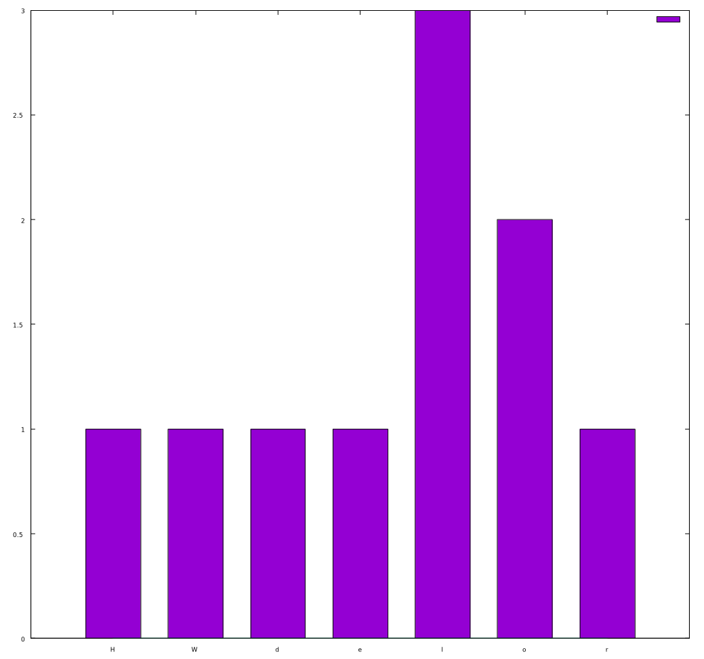

Lab. Work No.1 Taylor Series  
=

Source is free and available at https://github.com/EvalBeno/RTR-105/


Purpose
==
This program is representation of bubble sorting.  
* Bubble Sorting - is the common name for the sorting algorithm which compares the two members side by side and then moves the bigger value one further up the array.
* This code takes a one word and sorts it according to ASCII value, or in other words alphabetic order, but giving the priority to the capital letters.  

Although bubble sorting is the main idea of this code this code also provides with secondary functions which work only after the sorting algorithm these are:  
* Maximum character which is the first in the array after sorting.
* Minimum character which is the last occupied member in the array, after sorting.
* Average character which sums all members and divides by the number of members.
* Median character which is in the middle of the array.
* Mode character which is the most repedetive character of the array.

Code for the function:
==
```
#include <stdio.h>
#include <string.h>
#define N 30

char average(char string[N], int length);
char median(char string[N], int length);
char mode(char string[N], int length);

int main()
{
    char string[N];
    printf("Enter a word: ");
    scanf("%s", string);
    int length=strlen(string);
// Sorting algorithm    
    for(int i=0; i<length; i++){
        for(int j=0; j<length-1; j++){
            if(string[j]>string[j+1]){
                char temp=string[j+1];
                string[j+1]=string[j];
                string[j]=temp;
            }
        }
    }
    printf("The minimum value char is: %c\n", string[0]);
    printf("The maximum value char is: %c\n", string[length-1]);
    printf("The average value char is: %c\n", average(string, length));
    printf("The median value char is: %c\n", median(string, length));
    printf("The mode value char is: %c\n", mode(string, length));
    printf("The sorted string looks like this: %s\n", string);
    
    return 0;
}

char average(char string[N], int length){
    int sum=0;
    for(int i=0; i<length; i++){
        sum=sum+string[i];
    }
    return sum/length;
}

char median(char string[N], int length){
    return string[length/2];
}

char mode(char string[N], int length){
    int maxValue=0, maxCount=0;
    for(int i=0; i < length; i++){
        int count=0;
        for(int j=0 ; j<length ; j++){
            if(string[j] == string[i])
                count++;
        }
        if (count > maxCount){
            maxCount = count;
            maxValue = string[i];
        }
    }
    return maxValue;
}
```
You can change the `#define N 30` to accomodate bigger values than 30.

Usage
==

To compile use:`gcc Laboratory\ work\ Nr.5.c`

After you launch the function it looks like this
==
```
Enter a word: HelloWorld
The minimum value char is: H
The maximum value char is: r
The average value char is: f
The median value char is: l
The mode value char is: l
The sorted string looks like this: HWdellloor
```

Here is the distribution histogram of `HelloWorld`
====


**There is also source code for the histogram:**

To be able to use it you must have GNUPLOT installed.

Type in terminal:  
`gnuplot`  
And when you are inside GNUPLOT program type in:  
`load 'gnuplotscript.p'`  


*This project was made as part of computer studies class in Riga Techincal University*
